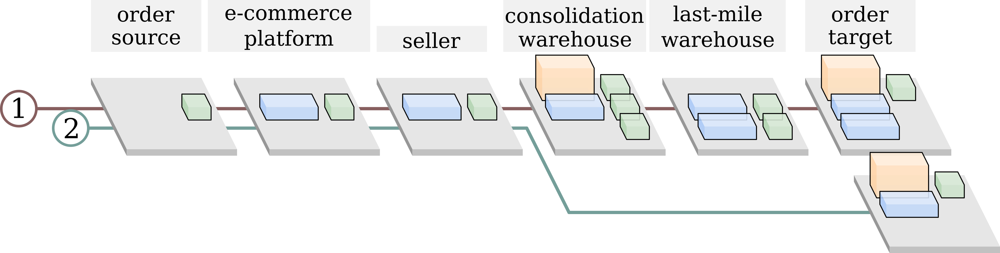

# OFCOURSE: A Multi-Agent Reinforcement Learning Environment for Order Fulfillment

Code repository for paper "OFCOURSE: A Multi-Agent Reinforcement Learning Environment for Order Fulfillment" under review of NeurIPS 2023 Datasets and Benchmarks Track.


# Installation

This repository requires Python >= 3.7.
[Miniconda](https://docs.conda.io/en/latest/miniconda.html#system-requirements)/[Anaconda](https://docs.anaconda.com/anaconda/install/) is our recommended Python distribution.

To get started:

1. Clone this repository and move to the OFCOURSE directory:

```console
>>> git clone https://github.com/GitYiheng/ofcourse.git && cd ofcourse
```

2. Install the dependencies:

```console
>>> pip install -r requirements.txt
```

# Reproducing Paper Results

## Task 1 &mdash; Fulfillment of Physical and Virtual Orders in One System

```console
>>> sh ./run_exp/exp1/run_exp1_ppo.sh
>>> sh ./run_exp/exp1/run_exp1_happo.sh
>>> sh ./run_exp/exp1/run_exp1_ippo.sh
>>> sh ./run_exp/exp1/run_exp1_clo.sh
```

## Task 2 &mdash; Cross-Border Order Fulfillment

```console
>>> sh ./run_exp/exp2/run_exp2_ppo.sh
>>> sh ./run_exp/exp2/run_exp2_happo.sh
>>> sh ./run_exp/exp2/run_exp2_ippo.sh
>>> sh ./run_exp/exp2/run_exp2_clo.sh
```

For these two tasks, the fulfillment agents are defined in [env/define_exp1_env.py](env/define_exp1_env.py) and [env/define_exp2_env.py](env/define_exp2_env.py).

# Training

```python
# file name: main.py
from algo.runner import Runner                          # import runner
from algo.arguments import get_args                     # import argument parser
args = get_args()                                       # parse arguments
runner = Runner(args)                                   # create a runner instance with specified arguments
runner.run()                                            # start learning or evaluation
```

Train `happo` on `exp1`:

```console
>>> python main.py --env=exp1 --algo=happo --mode=learn --log_dir=runs/exp1_happo --seed=10
```

Monitor the training progress with [TensorBoard](https://pytorch.org/docs/stable/tensorboard.html):

```console
>>> tensorboard --log_dir=runs
```

# Import Existing Environment

OFCOURSE is structured according to the format of [OpenAI Gym](https://github.com/openai/gym).
It is the standard API to communicate between reinforcement learning algorithms and environments.

```python
from env.exp1_env import Exp1Env                       # import env
env = Exp1()                                           # create an env instance
obs = env.reset()                                      # start a new episode
num_steps = 10                                         # number of steps
for _t in range(num_steps):
    sampled_actions = env.action_space.sample()        # sample actions (not from algo)
    obs, rewards, dones, _ = env.step(sampled_actions) # interact with env
    if all(dones):
        obs = env.reset()                              # start a new episode when current one ends
```

# Customize Environment

Customized fulfillment systems can be constructed in OFCOURSE.
Here, we use [Task 1 (Fulfillment of Physical and Virtual Orders in One System)](env/define_exp1_env.py) from the paper as an example.

<p align="center"></p>

## Import Modules

```python
import numpy as np
from env.resource import Resource
from env.order import Order
from env.container import Buffer, Inventory
from env.operation import OpStore, OpRoute, OpConsoRoute, OpDispatch
from env.fulfillment_unit import FulfillmentUnit
from env.agent import Agent
from env.order_source import OrderSource
```

## System Variables

Before defining the fulfillment system, we first define the buffer length and inventory capacity.

```python
# ---------- PARAMS ---------- #
buffer_len = 5
inventory_limit = 32
```

## Agents

There are two agents in the fulfillment system. Agent 0 is consisted of 6 fulfillment units and agent 1 is composed of 4 fulfillment units, where they share the first three stages.

```python
# ---------- AGENT 0 ---------- #
agent0 = Agent()
agent0.add_fulfillment_unit(agent0_layer5)
agent0.add_fulfillment_unit(agent0_layer4)
agent0.add_fulfillment_unit(agent0_layer3)
agent0.add_fulfillment_unit(agent0_layer2)
agent0.add_fulfillment_unit(agent0_layer1)
agent0.add_fulfillment_unit(agent0_layer0)

# ---------- AGENT 1 ---------- #
agent1 = Agent()
agent1.add_fulfillment_unit(agent1_layer3)
agent1.add_fulfillment_unit(agent1_layer2)
agent1.add_fulfillment_unit(agent1_layer1)
agent1.add_fulfillment_unit(agent1_layer0)
```

## Fulfillment Stage

Taking the third stage (i.e. the consolidation warehouse) of agent 0 for example, it has two Containers and three Operations.
Each Container has its associated Resource, in which we define Resource before attaching it to the corresponding Container.
Here, one Container is an Inventory and another Container is a Buffer.
In regard to Operations, we have one Operation for storing incoming Orders to the Inventory and two Operations for consolidating and dispatching Orders toward their destinated Buffers.

```python
# 3rd stage in agent 0
agent0_layer3 = FulfillmentUnit()
agent0_layer3_inventory_resource = Resource(constraint=32, normal_price=0.6, overage_price=2.0, occupied=0)
agent0_layer3_buffer0_resource = Resource(constraint=-1, normal_price=0.0, overage_price=0.0, occupied=0)
agent0_layer3_inventory = Inventory(resource=agent0_layer3_inventory_resource, inventory_limit=inventory_limit)
agent0_layer3_buffer0 = Buffer(resource=agent0_layer3_buffer0_resource, buffer_len=buffer_len)
agent0_layer3.add_container(container=agent0_layer3_inventory)
agent0_layer3.add_container(container=agent0_layer3_buffer0)
agent0_layer3_op0 = OpStore(buffers_orig=[agent0_layer3_buffer0], inventory_dest=agent0_layer3_inventory, op_price=0.1, op_time=1)
agent0_layer3_op1 = OpConsoRoute(buffers_orig=[agent0_layer3_buffer0], inventory_orig=agent0_layer3_inventory, buffer_dest=agent0_layer4_buffer0, op_price=4.0, op_time=3)
agent0_layer3_op2 = OpConsoRoute(buffers_orig=[agent0_layer3_buffer0], inventory_orig=agent0_layer3_inventory, buffer_dest=agent0_layer4_buffer1, op_price=8.0, op_time=2)
agent0_layer3.add_operation(operation=agent0_layer3_op0)
agent0_layer3.add_operation(operation=agent0_layer3_op1)
agent0_layer3.add_operation(operation=agent0_layer3_op2)
```

# Order Source Management

The order source is a mechanism that takes in the simulation step as its input and generates a set of order instances as its output.
Currently, orders are placed according to a prescribed repeating pattern.
External order source management will be added soon.

# Data Collection and Generation

The fulfillment systems presented in the paper are inspired by practical problems: experiment 1 (fulfillment of physical and virtual orders in one system) originates from Cainiao's domestic fulfillment business and experiment 2 (cross-border order fulfillment) stems from the fulfillment business of AliExpress.
Due to data disclosure regulation of the company, synthetic data is used for demonstration, which can be found in [exp1](env/define_exp1_env.py) and [exp2](env/define_exp2_env.py).

# Action Space and Observation Space

See [docs/act_obs.md](docs/act_obs.md).
